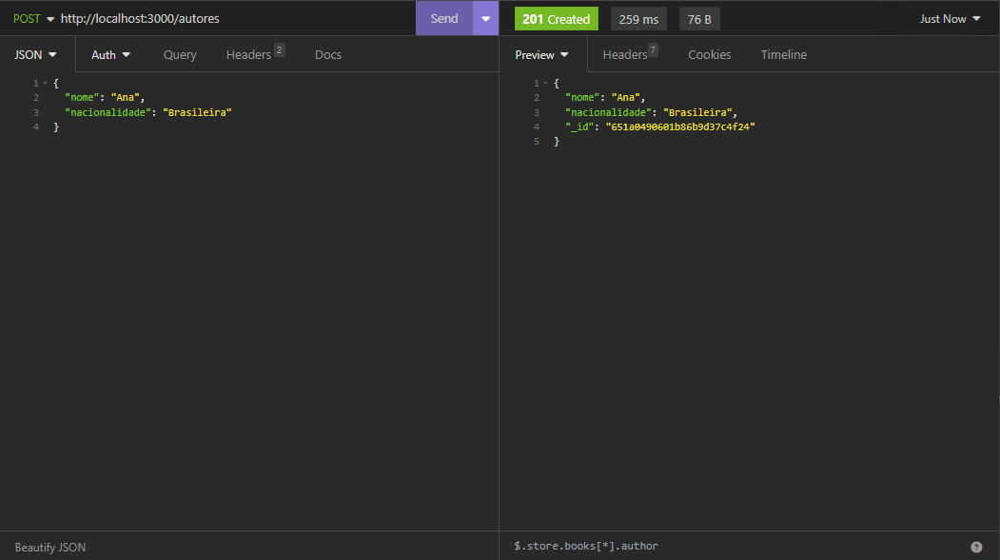

<h1>API REST Biblioteca</h1>

Este projeto consiste em uma API REST para gerenciamento de uma biblioteca, desenvolvida em Node.js e Express.js. Ela fornece rotas para manipulação de livros e autores.

<h2>Instalação</h2>

<ol>
  <li>Clone este repositório em sua máquina local:</li>
  <pre><code>git clone &lt;URL do repositório&gt;</code></pre>

  <li>Navegue até o diretório do projeto:</li>
  <pre><code>cd &lt;diretório do projeto&gt;</code></pre>

  <li>Instale as dependências do projeto:</li>
  <pre><code>npm install</code></pre>
</ol>

<h2>Execução</h2>

Para iniciar o servidor, utilize o seguinte comando:

<pre><code>npm run dev</code></pre>

Certifique-se de ter o Node.js (versão 14 ou superior) e o NPM (gerenciador de pacotes do Node.js) instalados em seu sistema.

<h2>Rotas</h2>

<h3>Rota de Autores:</h3>

<ul>
  <li><strong>GET /autores:</strong> Lista todos os autores. Suporta paginação.</li>

  <li><strong>GET /autores/busca:</strong> Lista autores com base em um filtro. Suporta paginação.</li>

  <li><strong>GET /autores/:id:</strong> Retorna informações sobre um autor específico com base no ID.</li>

  <li><strong>POST /autores:</strong> Cadastra um novo autor.</li>

  <li><strong>PUT /autores/:id:</strong> Atualiza as informações de um autor existente com base no ID.</li>

  <li><strong>DELETE /autores/:id:</strong> Exclui um autor com base no ID.</li>
</ul>

<h3>Rota de Livros:</h3>

<ul>
  <li><strong>GET /livros:</strong> Lista todos os livros. Suporta paginação.</li>

  <li><strong>GET /livros/busca:</strong> Lista livros com base em um filtro. Suporta paginação.</li>

  <li><strong>GET /livros/:id:</strong> Retorna informações sobre um livro específico com base no ID.</li>

  <li><strong>POST /livros:</strong> Cadastra um novo livro.</li>

  <li><strong>PUT /livros/:id:</strong> Atualiza as informações de um livro existente com base no ID.</li>

  <li><strong>DELETE /livros/:id:</strong> Exclui um livro com base no ID.</li>
</ul>

<h2>Utilização</h2>

Você pode acessar essas rotas utilizando ferramentas como Postman ou através de chamadas HTTP diretamente.

<h2>Exemplos</h2>

A seguir estão algumas capturas de tela dos exemplos de uso:

<h3>Listar autores:</h3>
  

<h3>Cadastrar autor:</h3>
  

<h3>Listagem por ID de autor:</h3>
  

<h3>Exclusão de autor:</h3>
  

