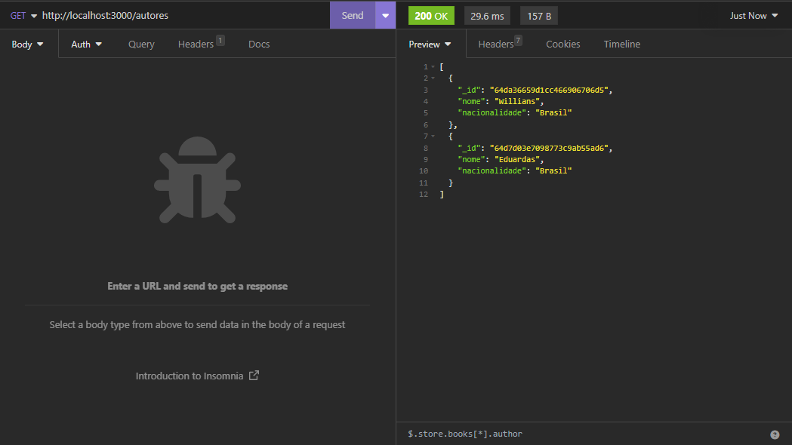
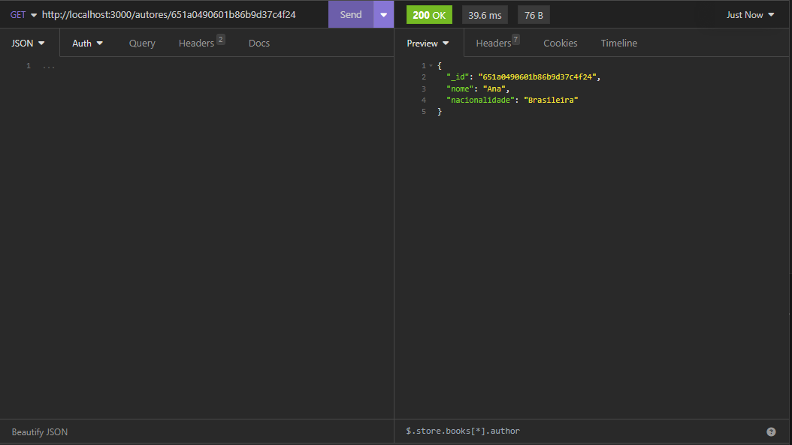
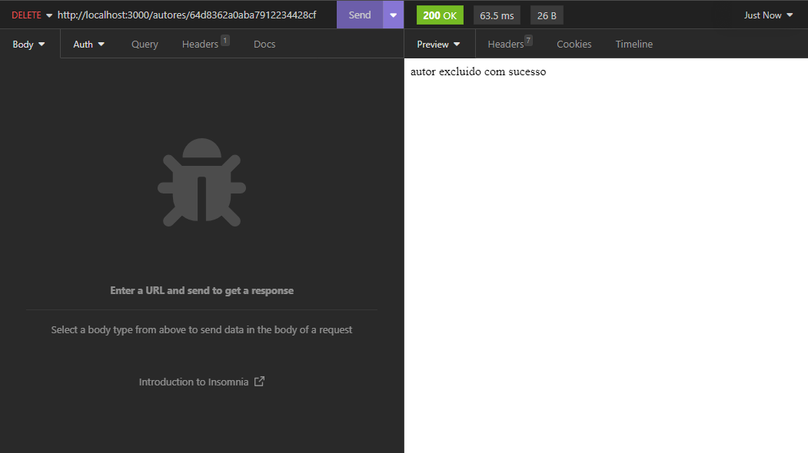

Este é um projeto de livraria baseado em Node.js e Express.js que fornece rotas para gerenciar livros e autores. 
Este README fornecerá informações sobre como configurar, executar e usar este projeto.

Clone este repositório em sua máquina local:
git clone <URL do repositório>

Navegue até o diretório do projeto
cd <diretório do projeto>

Instale as dependências do projeto:
npm install

Após a configuração, você pode usar este projeto para gerenciar livros e autores por meio de suas rotas. Para iniciar o servidor, execute o seguinte comando:
npm run dev

Pré-requisitos:
Node.js (versão 14 ou superior)
NPM (gerenciador de pacotes do Node.js)
O projeto fornece as seguintes rotas:

Rota de Autores:

GET /autores: Lista todos os autores. Também suporta paginação.

GET /autores/busca: Lista autores com base em um filtro. Também suporta paginação.

GET /autores/:id: Retorna informações sobre um autor específico com base no ID.

POST /autores: Cadastra um novo autor.

PUT /autores/:id: Atualiza as informações de um autor existente com base no ID.

DELETE /autores/:id: Exclui um autor com base no ID.

Rota de Livros:

GET /livros: Lista todos os livros. Também suporta paginação.

GET /livros/busca: Lista livros com base em um filtro. Também suporta paginação.

GET /livros/:id: Retorna informações sobre um livro específico com base no ID.

POST /livros: Cadastra um novo livro.

PUT /livros/:id: Atualiza as informações de um livro existente com base no ID.

DELETE /livros/:id: Exclui um livro com base no ID.

Você pode acessar essas rotas usando uma ferramenta como o Postman ou através de chamadas HTTP diretamente.

